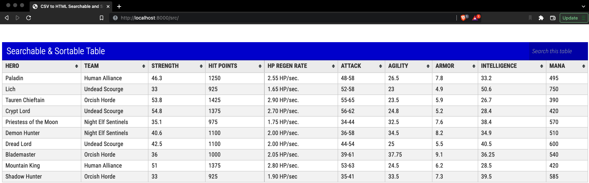

# CSV to HTML Searchable and Sortable Table

A simple HTML that converts your CSV file into a __Searchable__ and __Sortable__ table.

## Prerequisites

* Python v3.x environment installed locally _or_ any alternative HTTP server

## Usage

1. Clone this repository locally.

1. Copy your `.csv` to the csv folder.
1. Update `script.js` with the name of your file e.g. `var csvfile_import_122860 = "./csv/example.csv".replace(/\&amp\;/g, '&');`
1. Start the HTTP server locally ```python -m http.server```.
1. In the browser, go to ```http://localhost:8000/src/```.


